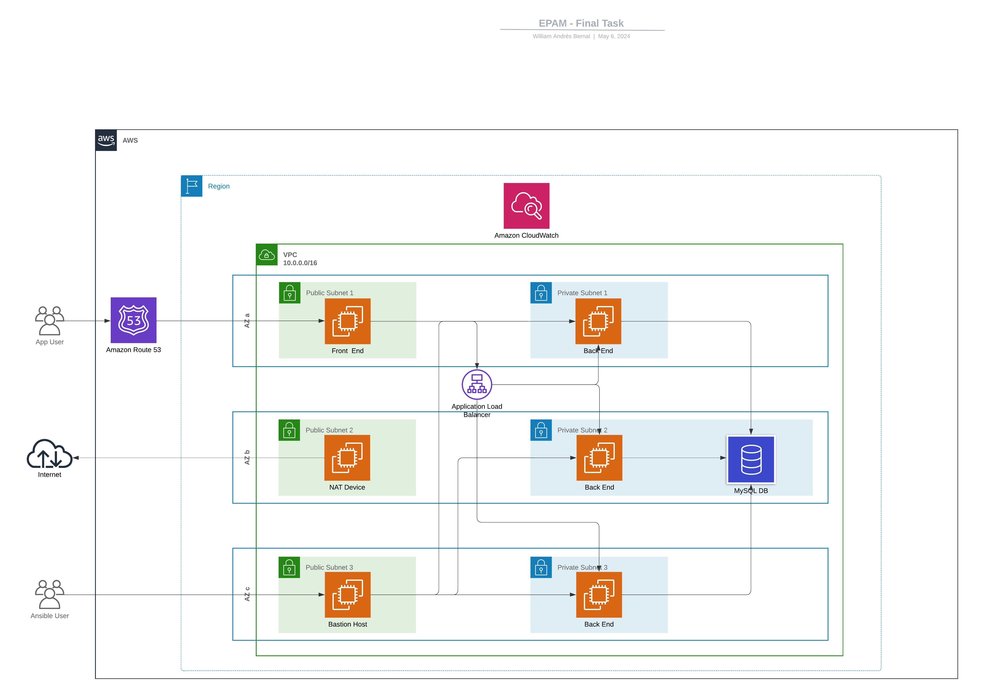

# Terraform EPM Project - AWS Movie Database Infrastructure

A comprehensive Terraform project that deploys a scalable 3-tier web application infrastructure on AWS for a movie database application. This project demonstrates enterprise-level infrastructure patterns including VPC networking, auto-scaling, load balancing, and configuration management with Ansible.

## 🏗️ Architecture Overview

This project creates a complete AWS infrastructure with the following components:



### Infrastructure Components

- **VPC**: Custom VPC with public and private subnets across multiple AZs
- **Frontend**: Single EC2 instance in public subnet (port 3030)
- **Backend**: Auto-scaling group with load balancer in private subnets (port 3000)
- **Database**: MySQL 8.0.35 RDS instance in private subnets
- **NAT Instance**: Custom NAT instance for private subnet internet access
- **Bastion Host**: Jump server with Ansible pre-installed for configuration management
- **DNS**: Route 53 hosted zone for custom domain
- **Monitoring**: CloudWatch dashboard for frontend instance monitoring

## ✨ Features

- **High Availability**: Multi-AZ deployment with auto-scaling
- **Security**: Private subnets for backend and database, NAT instance for controlled internet access
- **Automation**: Complete infrastructure as code with Terraform
- **Configuration Management**: Ansible playbooks for application deployment
- **Monitoring**: CloudWatch integration for infrastructure monitoring
- **Scalability**: Auto-scaling group for backend instances (1-2 instances)
- **Load Balancing**: Internal ELB for backend traffic distribution

## 📋 Prerequisites

Before deploying this infrastructure, ensure you have:

1. **AWS Account** with appropriate permissions
2. **AWS CLI** configured with valid credentials
3. **Terraform** or **OpenTofu** installed (this project uses OpenTofu)
4. **SSH Key Pair** created in your AWS account
5. **Domain Name** (optional, for DNS configuration)
6. **S3 Bucket** for Terraform state storage
7. **DynamoDB Table** for state locking

### Required AWS Permissions

Your AWS user/role needs permissions for:
- EC2 (instances, security groups, load balancers)
- VPC (subnets, route tables, internet gateways)
- RDS (database instances, subnet groups)
- Route 53 (hosted zones, records)
- IAM (roles, policies, instance profiles)
- CloudWatch (dashboards, metrics)
- Auto Scaling (groups, launch configurations)

## 🚀 Quick Start

### 1. Clone the Repository

```bash
git clone https://github.com/willbender/terraform-epm-project.git
cd terraform-epm-project
```

### 2. Configure Backend (Optional)

Update `backend.tf` with your S3 bucket and DynamoDB table:

```hcl
terraform {
    backend "s3" {
        bucket = "your-tfstate-bucket"
        key = "state/terraform.tfstate"
        encrypt = true
        region = "us-east-1"
        dynamodb_table = "your-tf-lockid-table"
    }
}
```

### 3. Configure Variables

Copy and modify the variables in `variables.tf` or create a `terraform.tfvars` file:

```hcl
environment = "qa"
region = "us-east-1"
key_name = "your-key-pair-name"
domain_name = "your-domain.com"
mysql_password = "your-secure-password"
```

### 4. Deploy Infrastructure

Use the provided script for automated deployment:

```bash
chmod +x run-tf.sh
./run-tf.sh your-private-key.pem
```

Or deploy manually:

```bash
# Initialize Terraform
tofu init

# Plan deployment
tofu plan -out=plan-file

# Apply changes
tofu apply plan-file
```

## ⚙️ Configuration

### Core Variables

| Variable | Description | Default | Required |
|----------|-------------|---------|----------|
| `region` | AWS region for deployment | `us-east-1` | No |
| `environment` | Environment name (qa/prod) | `qa` | No |
| `cidr` | VPC CIDR block | `10.0.0.0/16` | No |
| `key_name` | EC2 Key Pair name | `william` | Yes |
| `domain_name` | Domain for Route 53 | `devops.cloud.epm.final` | Yes |
| `ami` | AMI ID for EC2 instances | `ami-07caf09b362be10b8` | No |
| `instance_type` | EC2 instance type | `t2.micro` | No |

### Database Configuration

| Variable | Description | Default |
|----------|-------------|---------|
| `mysql_version` | MySQL engine version | `8.0.35` |
| `mysql_instance_class` | RDS instance class | `db.t3.micro` |
| `mysql_db_name` | Database name | `movie_db` |
| `mysql_username` | Database username | `applicationuser` |
| `mysql_password` | Database password | `applicationuser` |
| `allocated_storage` | Storage size (GB) | `10` |

### Network Configuration

The project creates the following subnets by default:

**Public Subnets:**
- `10.0.1.0/24` - us-east-1a (NAT Instance)
- `10.0.2.0/24` - us-east-1b (Bastion Host)
- `10.0.3.0/24` - us-east-1c (Frontend)

**Private Subnets:**
- `10.0.4.0/24` - us-east-1a (Backend/Database)
- `10.0.5.0/24` - us-east-1b (Backend/Database)
- `10.0.6.0/24` - us-east-1c (Backend/Database)

## 📦 Modules

This project is organized into reusable Terraform modules:

### Core Modules

| Module | Purpose | Resources |
|--------|---------|-----------|
| `vpc` | Network infrastructure | VPC, subnets, route tables, IGW |
| `mysql` | Database service | RDS MySQL instance, subnet group |
| `nat` | Internet access for private subnets | NAT instance, security groups |
| `bastion-host` | Jump server and Ansible controller | EC2 instance, IAM role |
| `front-end` | Web frontend | EC2 instance, security groups |
| `back-end` | API backend with auto-scaling | ELB, Auto Scaling Group, Launch Config |
| `dns` | Domain name resolution | Route 53 hosted zone, records |
| `cloud-watch` | Monitoring and dashboards | CloudWatch dashboard |

### Module Documentation

Each module includes its own README with specific usage instructions:

- [VPC Module](modules/vpc/README.md)
- [Backend Module](modules/back-end/README.md)
- [Frontend Module](modules/front-end/README.md)
- [DNS Module](modules/dns/README.md)

## 📤 Outputs

After successful deployment, the following outputs are available:

| Output | Description |
|--------|-------------|
| `bastion_ip` | Public IP of the bastion host |
| `backend_dns` | DNS name of the backend load balancer |
| `frontend_ip` | Public IP of the frontend instance |
| `mysql_address` | RDS instance endpoint |

Access these outputs with:

```bash
tofu output bastion_ip
tofu output frontend_ip
```

## 🚀 Deployment Process

The `run-tf.sh` script automates the entire deployment and configuration process:

1. **Infrastructure Deployment**: Creates all AWS resources via Terraform
2. **Output Extraction**: Captures important connection details
3. **Configuration Update**: Updates Ansible playbooks with dynamic values
4. **File Upload**: Transfers Ansible playbooks to bastion host
5. **Application Configuration**: Runs Ansible playbooks to configure services
6. **Validation**: Opens browser to verify frontend accessibility

### Manual Configuration

If you prefer manual configuration, use the bastion host:

```bash
# SSH to bastion host
ssh -i your-key.pem ec2-user@$(tofu output -raw bastion_ip)

# Navigate to ansible directory
cd /home/ec2-user/ansible

# Run configuration script
./configure-servers.sh
```

## 📊 Monitoring

The infrastructure includes CloudWatch monitoring for:

- **Frontend Instance**: CPU, memory, disk utilization
- **Auto Scaling Group**: Instance health, scaling activities
- **Load Balancer**: Request count, latency, health checks
- **RDS Database**: Connections, CPU, storage utilization

Access the CloudWatch dashboard through the AWS Console after deployment.

## 🛠️ Troubleshooting

### Common Issues

1. **SSH Connection Failed**
   - Verify security group rules allow SSH (port 22)
   - Ensure key pair name matches the one specified in variables
   - Check that the key file has correct permissions (400)

2. **Frontend Not Accessible**
   - Verify security group allows HTTP traffic on port 3030
   - Check that the instance is running and healthy
   - Ensure Ansible configuration completed successfully

3. **Backend Connection Issues**
   - Verify load balancer health checks are passing
   - Check that backend instances are registered with ELB
   - Ensure database connectivity from backend instances

### Logs and Debugging

- **Terraform Logs**: Enable with `TF_LOG=DEBUG tofu apply`
- **Instance Logs**: Access via SSH and check `/var/log/`
- **Ansible Logs**: Available on bastion host after configuration runs

## 🤝 Contributing

1. Fork the repository
2. Create a feature branch (`git checkout -b feature/amazing-feature`)
3. Commit your changes (`git commit -m 'Add amazing feature'`)
4. Push to the branch (`git push origin feature/amazing-feature`)
5. Open a Pull Request

### Development Guidelines

- Follow Terraform best practices and style conventions
- Update module documentation for any changes
- Test changes in a separate environment before submitting
- Include appropriate variable descriptions and validation

## 📄 License

This project is part of an EPM training program and is intended for educational purposes.

## 👤 Author

**Will Bender** - EPM Final Project

---

For questions or support, please refer to the project documentation or open an issue in the repository.